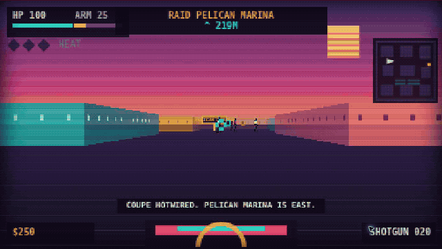
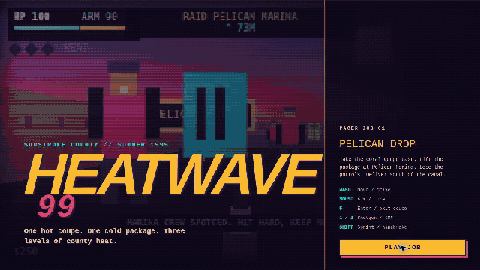
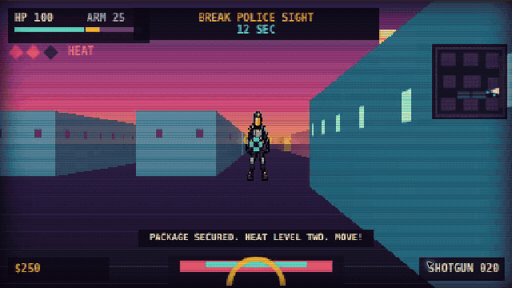
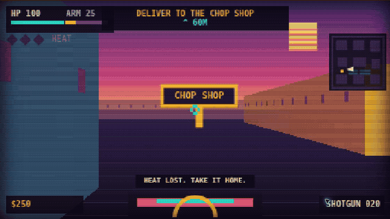

# Heatwave 99

Heatwave 99 is an original browser boomer shooter set in fictional Sunstroke
County. The first job sends you across one coastal district to steal a coral
coupe, raid Pelican Marina, shake a police response, and deliver a package to a
chop shop. The district now has roaming civilians, witness reports, police
search behavior, roadblocks, and three buildings the player can walk into.

The project takes structural cues from the released GTA VI footage, then pushes
them through a 1990s ray-cast shooter. It does not use Rockstar code, names,
characters, maps, logos, music, or art.

## Proof

### Steal the coupe and cross the district



### Raid Pelican Marina



### Break police sight



### Deliver the package



## What is playable

- One connected coastal district rendered at 384 by 216 and scaled with
  nearest-neighbor filtering.
- One complete job with car theft, driving, shooting, police heat, escape, and
  payout states.
- A drivable coral coupe with arcade movement.
- A sawed-off shotgun and compact SMG with generated original sprite art.
- Twelve roaming civilians who wander, talk, flee gunfire, and report crimes
  they can see.
- Three continuous walk-in interiors: Sunwash Lobby, Sunshot Pawn, and Neon
  Gator Arcade. Clerks sell armor, ammunition, and health.
- Street-gang and patrol enemies with pursuit, line of sight, attacks, damage,
  and death. Police retain the player's last-known position and search toward
  it after sight breaks.
- Three visible heat levels with readable reporting, spotted, and search states.
  Higher heat adds officers and physical police roadblocks.
- A minimap, objective bearing, ammo, health, armor, cash, pager messages, and a
  score screen.
- Deterministic demo routes at `?demo=drive`, `?demo=combat`, `?demo=heat`, and
  `?demo=payoff` for artifact capture.

## Controls

| Input | Action |
| --- | --- |
| `WASD` | Move or drive |
| Mouse | Aim |
| Left click or `Space` | Fire |
| `F` | Enter or exit the coupe, talk, or buy |
| `1` | Sawed-off shotgun |
| `2` | Compact SMG |
| `Shift` | Sprint or handbrake |
| Arrow keys | Turn without pointer lock |

## Run it

The project requires Node.js 22.13 or newer.

```bash
npm ci
npm run dev
```

Useful checks:

```bash
npm run lint
npm run build
npm test
npm run test:cloudflare
```

## Deploy to Cloudflare Workers

The repository includes an assets-only Worker configuration in
`wrangler.jsonc`. Its separate static build writes a prerendered
`dist/client/index.html`; the normal `npm run build` remains the server build
used by the existing Sites deployment.

Authenticate Wrangler once, then deploy:

```bash
npx wrangler login
npm run deploy:cloudflare
```

For Cloudflare Git builds, use `npm run build:cloudflare` as the build command
and `npx wrangler deploy --config wrangler.jsonc` as the deploy command. SPA
fallback is enabled, so direct navigation to a client-side route serves the
game entry document while matching JavaScript, CSS, and image requests are
served as static assets.

## Project notes

- [Research record](docs/gta-vi-video-research.md)
- [Game design](docs/game-design.md)
- [Open-world feature roadmap](docs/open-world-roadmap.md)

The research record separates footage and developer-preview claims from frame
analysis and speculation. That distinction matters because GTA VI has not
shipped as of August 30, 2026.
